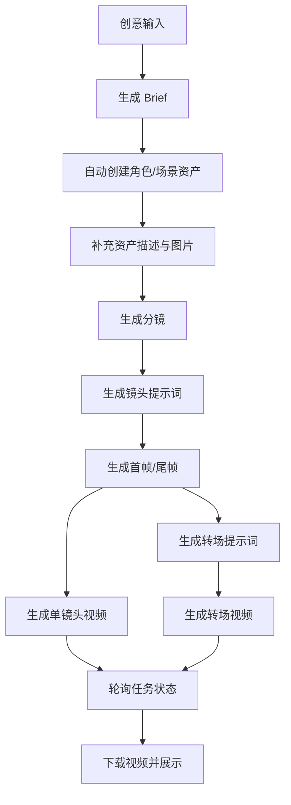

# 核心文档

## 1. 项目定位

`renren_ai_video` 是一个前端驱动的 AI 视频编排工作台。用户从一句创意想法开始，系统逐步生成并组织以下结果：

- 创意简报 `Brief`
- 一致性资产 `Asset`
- 分镜列表 `Shot[]`
- 首帧 / 尾帧图片
- 单镜头视频
- 转场提示词与转场视频

它不是传统“后端任务中心”架构，而是浏览器直接持有项目状态、直接请求模型供应商、直接轮询异步任务，并把结果保存到本地。

## 2. 功能全景

### 2.1 创作流程功能

- 创意输入页支持故事描述、画面比例选择、风格手动选择或自动匹配
- 简报页支持编辑题材、风格、比例、时长、平台、角色、场景、事件摘要
- 资产页支持角色、场景、风格、道具四类一致性资产
- 角色资产支持细化人物类型、年龄感、服饰、配色、标志性道具等字段
- 场景资产支持细化时代、建筑地貌、天气、光线、前景元素、禁用元素等字段
- 分镜页支持生成提示词、生成首尾帧、上传首帧、编辑镜头语义和参考资产
- 视频页支持单镜头视频生成、转场提示词生成、转场视频生成
- 时间线页用于整片结构预览

### 2.2 模型与供应商功能

- 默认支持两套供应商：`Google AI Studio` 与 `火山引擎 Ark`
- 支持按 `text / image / video` 三个角色配置默认供应商和模型
- 支持在单个操作层面覆盖模型，不必全局切换
- 支持按供应商设置提示词语言 `zh / en`
- 支持显示模型价格标签，并在操作面板上估算成本
- 支持查看最近 50 条模型调用日志

### 2.3 工程辅助功能

- 项目自动保存到 `localforage`
- API 设置自动保存到 `localStorage`
- 模型调用日志保存到 `localStorage`
- 支持 `Mock` 模式
- 支持浅色 / 深色主题

## 3. 架构总览

### 3.1 技术栈

- UI：React 19
- 构建：Vite 6
- 语言：TypeScript
- 动画：`motion`
- 图标：`lucide-react`
- 项目存储：`localforage`
- 浏览器配置存储：`localStorage`
- Gemini SDK：`@google/genai`
- 火山引擎调用方式：浏览器 `fetch`

### 3.2 模块分层

- [`src/App.tsx`](src/App.tsx)：单页应用主控层，负责视图切换、表单编辑、业务事件、轮询、项目持久化和 UI 渲染
- [`src/services/modelService.ts`](src/services/modelService.ts)：模型路由层，按 `ModelSourceId` 选择供应商并写入调用日志
- [`src/services/geminiService.ts`](src/services/geminiService.ts)：Gemini / Veo 适配层，处理文本、图片、视频生成和视频下载
- [`src/services/volcengineService.ts`](src/services/volcengineService.ts)：火山引擎 Ark 适配层，处理文本、图片、视频生成与状态查询
- [`src/services/apiConfig.ts`](src/services/apiConfig.ts)：API 配置、默认模型、模型目录、价格换算和配置持久化
- [`src/services/requestBuilders.ts`](src/services/requestBuilders.ts)：构建 Gemini 图像 / 视频请求体，处理首尾帧、参考图、分辨率和宽高比约束
- [`src/services/styleCatalog.ts`](src/services/styleCatalog.ts)：风格预设、自动匹配和风格注入
- [`src/services/modelInvocationLog.ts`](src/services/modelInvocationLog.ts)：模型调用日志裁剪、存储和事件广播
- [`src/services/promptAspectRatio.ts`](src/services/promptAspectRatio.ts)：首帧 / 尾帧提示词比例约束补齐
- [`src/types.ts`](src/types.ts)：领域模型定义

### 3.3 当前架构特点

- 优点：功能集中、迭代快、跨供应商切换简单
- 代价：`App.tsx` 体量大，状态与渲染高度耦合，维护成本会随功能增长继续上升

## 4. 页面结构

`App.tsx` 内通过 `view` 驱动单页导航，当前视图包括：

- `home`
- `input`
- `brief`
- `shots`
- `timeline`
- `videos`
- `apiConfig`

当前没有路由系统，也没有按页面拆分组件树。所有业务都在一个大组件中串联。

## 5. 数据模型

### 5.1 Brief

[`Brief`](src/types.ts:3) 表示结构化创意摘要，关键字段包括：

- `theme`
- `style`
- `stylePresetId`
- `stylePrompt`
- `characters`
- `scenes`
- `events`
- `mood`
- `duration`
- `aspectRatio`
- `platform`

### 5.2 Asset

[`Asset`](src/types.ts:19) 用于维护视觉一致性，支持：

- `character`
- `scene`
- `style`
- `prop`

角色和场景资产分别支持更细的结构化描述字段，供 AI 生成提示词时使用。

### 5.3 Shot

[`Shot`](src/types.ts:107) 是系统最核心的数据对象，混合了承载：

- 镜头文案
- 图像提示词
- 视频提示词
- 首尾帧媒体结果
- 视频任务状态
- 转场任务状态
- 视频参数配置

它同时承担“编辑模型 + 任务状态 + 结果缓存”三种职责。

### 5.4 Project

[`Project`](src/types.ts:153) 是顶层聚合对象，保存：

- 项目名
- 创意描述
- 风格选择状态
- 输入比例
- `brief`
- `assets`
- `shots`

## 6. 核心数据流

### 6.1 Brief 生成

- 入口：`handleGenerateBrief`
- 服务：`generateBriefWithModel`
- 行为：生成结构化简报、自动匹配或应用风格预设，并以简报中的角色和场景自动创建基础资产

### 6.2 资产生成

- 入口：`handleGenerateAssetPrompt` / `handleGenerateAssetImage`
- 支持 AI 生成资产图像提示词
- 支持上传本地图作为替代
- 所有资产图都会参与后续镜头参考

### 6.3 分镜生成

- 入口：`handleGenerateShots`
- 服务：`generateShotList`
- 额外逻辑：若镜头未显式引用场景资产，前端会尝试自动绑定场景参考

### 6.4 镜头提示词生成

- 入口：`handleGeneratePrompts`
- 服务：`generatePromptsForShot`
- 结果包括：首帧图像提示词、尾帧图像提示词、视频提示词

补充逻辑：

- 风格预设会被附加到镜头提示词
- 首尾帧提示词会自动补齐比例约束
- 支持基于中文提示词重新翻译英文版本

### 6.5 视频执行提示词生成

除供应商返回的原始视频提示词外，前端还会在真正发起视频生成前，用 `buildDualModeVideoPrompts` 重新组装中英文执行提示词，显式加入：

- 分段时间轴
- 主体动作
- 表情和 blocking
- 镜头运动
- 台词口型要求
- 一致性资产约束
- 风格补充

这意味着“模型生成的视频提示词”和“最终执行的视频提示词”并不完全相同，前端会做一次本地强化。

### 6.6 视频与转场生成

- 单镜头视频入口：`handleGenerateVideo`
- 转场提示词入口：`handleGenerateTransitionPrompt`
- 转场视频入口：`handleGenerateTransitionVideo`

约束规则：

- 转场视频依赖“当前镜头尾帧 + 下一镜头首帧”
- 转场视频可以单独配置比例和时长
- 视频请求会根据首帧、尾帧、参考图自动调整模型和参数

### 6.7 异步状态轮询

- 轮询入口：`useEffect + setInterval`
- 周期：10 秒
- 范围：普通镜头视频与转场视频

完成后：

- 拉取远端视频
- 转成浏览器 `blob:` URL
- 回写到对应 `Shot`

## 7. 模型路由与供应商实现

### 7.1 路由方式

[`modelService.ts`](src/services/modelService.ts) 是统一网关。它的职责不是生成内容，而是：

- 根据 `ModelSourceId` 判断供应商
- 调用对应供应商服务
- 记录成功 / 失败日志

### 7.2 Gemini 路由

Gemini 侧负责：

- 文本生成：`generateBriefWithModel`、`generateShotList`、`generatePromptsForShot`、`generateTransitionPrompt`、`generateAssetPrompt`
- 图片生成：`generateStoryboardImage`、`generateAssetImage`
- 视频生成：`startVideoGeneration`、`startTransitionVideoGeneration`
- 视频轮询与下载：`checkVideoStatus`、`fetchVideoBlobUrl`

实现特点：

- 使用 `@google/genai`
- 文本生成大量依赖 JSON Schema
- 视频下载时会补上 API Key，并兼容 `generatedVideos` 与 `generatedSamples`

### 7.3 火山引擎路由

火山引擎侧负责同类能力，但实现方式不同：

- 文本：调用 `/chat/completions`
- 图片：调用 `/images/generations`
- 视频：调用对应视频接口并轮询任务状态

实现特点：

- 使用浏览器 `fetch`
- 自行解析返回 JSON
- 兼容不同字段命名的任务 ID 和 URL 返回

## 8. 模型配置与成本体系

### 8.1 默认模型配置

[`apiConfig.ts`](src/services/apiConfig.ts) 和 [`modelCatalog.json`](src/config/modelCatalog.json) 定义：

- 供应商标签
- 支持的提示词语言
- 文本 / 图像 / 视频模型目录
- 定价规则
- 汇率配置

当前默认供应商角色分为：

- 文本
- 图像
- 视频

### 8.2 配置界面能力

`apiConfig` 页面支持：

- 设置每个角色的默认供应商
- 设置每个供应商的 API Key
- 设置每个供应商的提示词语言
- 设置供应商内的具体模型值
- 恢复默认配置

### 8.3 成本信息

界面会结合：

- 模型定价
- 视频分辨率
- 帧率
- 时长
- 宽高比

给出当前操作的成本标签或估算信息。成本逻辑是前端展示辅助，不影响请求执行。

## 9. 风格系统

[`styleCatalog.ts`](src/services/styleCatalog.ts) 提供：

- 风格预设列表
- 输入文案自动匹配
- 风格说明拼接
- 提示词风格注入

风格系统的工作方式：

- 输入创意时可手动选风格，或由系统自动匹配
- 生成 `Brief` 后会把风格写入 `stylePresetId` 和 `stylePrompt`
- 后续图像、视频和转场提示词都会被附加风格一致性说明

## 10. 日志与可观测性

[`modelInvocationLog.ts`](src/services/modelInvocationLog.ts) 负责最近 50 条请求日志：

- 记录供应商、操作名、模型名、请求、响应、错误
- 自动裁剪长文本和 Data URL
- 保存到 `localStorage`
- 通过浏览器事件驱动界面更新

这部分是当前最直接的排错入口。

## 11. 持久化机制

### 11.1 项目存储

- 键：`ai_director_projects`
- 介质：`localforage`
- 兼容旧数据迁移：`localStorage -> localforage`

### 11.2 配置存储

- API 设置：`ai_director_api_settings`
- 模型调用日志：`ai_director_model_invocation_logs`
- 主题：`ai_director_theme_mode`

### 11.3 数据特点

- 资产图、首帧、尾帧多数以 Base64 Data URL 保存
- 视频结果保存在 `blob:` URL 上

影响：

- 本地存储压力大
- `blob:` URL 不适合作为长期持久化结果

## 12. 当前约束与维护风险

### 12.1 `App.tsx` 过重

当前 [`src/App.tsx`](src/App.tsx) 同时负责：

- 页面导航
- 状态管理
- 业务动作
- 持久化
- 轮询
- 成本展示
- 绝大多数 UI 渲染

这是目前最大的维护风险。

### 12.2 状态分散

当前存在多组并行 loading 状态：

- `generatingPrompts`
- `generatingImages`
- `generatingAssetImages`
- `generatingAssetPrompts`
- `translatingPrompts`

随着操作种类增加，继续扩散的概率很高。

### 12.3 浏览器存储压力

项目对象直接保存了大量 Base64 图片数据，最容易导致：

- 存储空间占用迅速增大
- 长项目读写变慢
- 持久化失败时用户只能收到通用错误提示

### 12.4 前端直连供应商

当前没有后端代理层，意味着：

- 密钥直接存在浏览器环境
- 不适合做更复杂的权限控制或队列调度
- 供应商接口变化会直接影响前端

### 12.5 前端与服务层存在双重提示词加工

镜头视频提示词既可能来自供应商生成，也会在前端被重新组织为执行版提示词。这个设计可以提升结果一致性，但也增加了理解成本。

## 13. 建议的演进方向

### 13.1 先拆业务状态层

优先把以下逻辑从 `App.tsx` 抽离：

- 项目读写
- 模型选择与成本估算
- 视频轮询
- 资产 / 分镜 / 视频操作事件

建议拆到：

- `hooks/`
- `stores/`
- `features/`

### 13.2 再拆页面和组件

推荐分出：

- `HomeView`
- `InputView`
- `BriefView`
- `ShotsView`
- `TimelineView`
- `VideosView`
- `ApiConfigView`

### 13.3 优化媒体持久化

后续应考虑：

- 图片改为对象存储或 IndexedDB 文件化存储
- 视频结果改为远端 URL 或可恢复的文件引用
- 避免把大体积 Base64 直接挂在 `Project`

### 13.4 把供应商适配进一步收敛成接口

当前 `modelService.ts` 已经是第一层抽象。下一步可进一步统一成明确的 provider interface，降低新增供应商时的重复实现成本。
