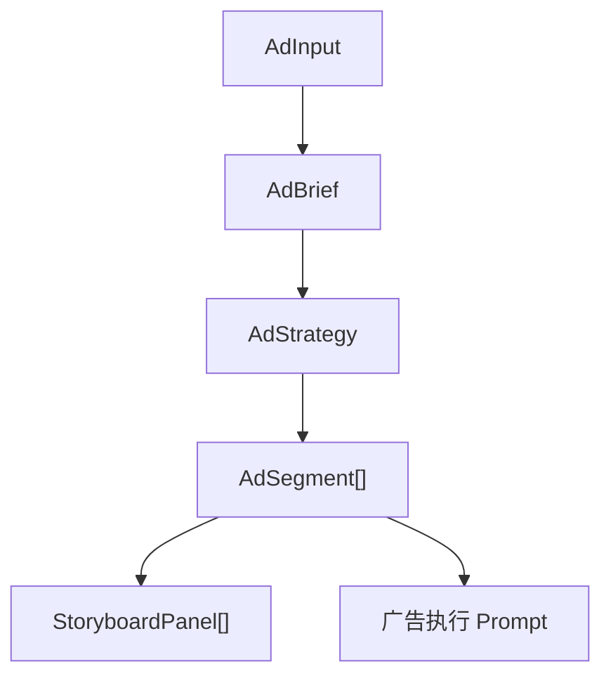

# 广告片工作流设计与开发计划

## 1. 背景

当前系统的主链路是：

`创意输入 -> Brief -> Asset -> Shot -> Prompt -> 首尾帧 -> 视频`

这条链路适合通用剧情和概念片，但不适合广告片。广告片更依赖品牌目标、卖点排序、传播钩子、节奏结构和品牌露出约束，不能直接从一句创意跳到 `Shot[]`。

因此需要新增一条并行工作流：

`adInput -> adStrategy -> adScript -> adStoryboard -> adVideo`

目标不是替换现有工作流，而是在同一项目内增加一套广告专用中间层，并继续复用：

- 现有供应商路由与 API 配置
- 模型调用日志
- Mock 模式
- 项目本地持久化
- 风格注入与后续视频模型执行能力

## 2. 设计原则

### 2.1 不把广告语义塞进旧 Shot

现有 [`Shot`](src/types.ts) 已经承载文案、提示词、媒体结果和任务状态，不适合继续吞下广告的策略层和脚本表层。

广告流程新增独立领域对象：

- `AdBrief`
- `AdStrategy`
- `AdSegment`
- `AdScriptRow`
- `StoryboardPanel`
- `AdProject`

### 2.2 先补中间层，再补媒体执行层

广告流程的一期先完成：

- 广告需求输入
- 广告 Brief 结构化
- 广告策略中间层
- 表格化广告脚本
- Markdown / JSON 导出

分镜拼板与广告视频执行放到二期、三期，但导航和目录结构先留出稳定边界。

### 2.3 继续复用现有模型网关

广告文本生成直接走现有：

- [`modelService.ts`](src/services/modelService.ts)
- [`geminiService.ts`](src/services/geminiService.ts)
- [`volcengineService.ts`](src/services/volcengineService.ts)

只新增广告专用 prompt 构造和 JSON schema。

## 3. 信息架构

当前侧边栏保留原有通用流程：

- `home`
- `input`
- `brief`
- `shots`
- `timeline`
- `videos`
- `apiConfig`

新增广告流程导航：

- `adInput`
- `adStrategy`
- `adScript`
- `adStoryboard`
- `adVideo`

建议在 UI 上将“通用工作流”和“广告工作流”分组显示，避免用户误把广告流程当成剧情流程的别名。

## 4. 数据模型

广告流程新增类型定义位于：

- [`adTypes.ts`](src/features/adFlow/types/adTypes.ts)

核心关系：



顶层项目聚合新增 `project.adFlow`，而不是把广告状态散落在 `App.tsx` 的多个独立 state。

## 5. 目录设计

新增目录：

```text
src/features/adFlow/
  components/
    AdInputView.tsx
    AdStrategyView.tsx
    AdScriptView.tsx
    AdStoryboardView.tsx
    AdVideoView.tsx
  services/
    adFlowMappers.ts
    adPromptBuilders.ts
  types/
    adTypes.ts
```

边界约束：

- `types/` 只维护广告领域模型
- `services/` 维护纯函数、导出与 prompt 构造
- `components/` 只负责页面 UI，不直接接供应商 SDK
- `App.tsx` 只做项目状态接线和流程入口，不再内联广告页面的大量 JSX

## 6. 一期功能范围

### 6.1 `adInput`

收集：

- 品牌名、产品名、类别、slogan
- 广告目标、人群、传播主题
- 时长、平台、画幅、风格、节奏
- 卖点、必出镜元素、禁用表达、法务限制
- 竞品参考、对标广告、CTA

输出：

- `AdBrief`

### 6.2 `adStrategy`

通过模型生成结构化策略对象，输出：

- `campaignTheme`
- `oneLineHook`
- `audienceInsight`
- `sellingPointPriority`
- `visualMotif`
- `audioMotif`
- `emotionalCurve`
- `persuasionPath`
- `memorabilityPoints`
- `brandMustHave`
- `riskGuardrails`
- `segmentPlan`

### 6.3 `adScript`

通过模型生成段落化脚本表，输出：

- `AdSegment[]`
- 每段 `scriptRows[]`
- Markdown / JSON 导出

## 7. 二期与三期

### 7.1 二期：`adStoryboard`

在段落脚本之上生成拼板分镜：

- 每段 6-9 格
- 段落整体重生成
- 单格重生成
- 包装锁定 / 场景锁定 / 角色锁定

### 7.2 三期：`adVideo`

生成广告执行 prompt 和投放版本：

- 段落级视频 prompt
- 单镜头视频 prompt
- 转场 prompt
- 48s / 30s / 15s 自动压缩版
- 不同比例和字幕版本导出

## 8. 技术决策

### 8.1 继续单页应用，不立刻引入路由

当前项目仍由 `view` 驱动页面切换，一期不引入 React Router，避免额外改动范围。

### 8.2 先补 feature slice，再考虑继续拆 App

`App.tsx` 仍然是入口，但广告工作流页面已经从大文件中切出去，后续可以逐步把通用流程也按同样方式拆分。

### 8.3 先用文本模型产出结构化 JSON

广告策略和脚本表都优先走文本模型；故事板图片和广告视频执行在后续阶段才接图像 / 视频模型。

## 9. 开发计划

### 已在本次迭代落地

1. 新增广告领域模型与纯函数服务
2. 新增广告设计文档
3. 新增 `adInput / adStrategy / adScript / adStoryboard / adVideo` 页面组件骨架
4. 接入广告流程导航和项目持久化
5. 接入广告策略与脚本生成服务
6. 接入 `adStoryboard` 段落拼板提示词生成、整段出图和单格重生成
7. 接入锁定格子后整段重生成不覆盖的基础交互
8. 接入 `adVideo` 执行 prompt 组装、段落视频参数与段落视频生成
9. 自动派生 48s / 30s / 15s / 9:16 / 1:1 / 无口播 / 英文字幕版本计划
10. 在现有 `timeline` 页补广告段落、字幕、产品露出和音频轨摘要

### 下一步

1. 把广告流程从 `App.tsx` 继续抽到 `hooks/`，降低主文件体积
2. 为广告分镜增加锁定包装 / 锁定角色 / 锁定场景的差异化重生成控制
3. 为广告执行层增加整片拼接和投放导出
4. 为广告版本增加真正的 AI 压缩与字幕翻译，而不是当前的规则派生
