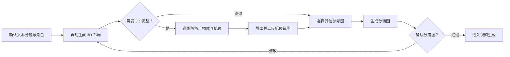

# 极速模式 3D 白模预演开发方案

状态：P0 首版已完成并通过 Electron Desktop 验收；后续工作流、批量 Agent 与声音工作台已进入规划  
确认日期：2026-07-26  
参考项目：[jiguang132/storyai-3d-director-desk](https://github.com/jiguang132/storyai-3d-director-desk)  
参考版本：`8c8bd361790be4d37158a7430365e65546e358fe`

集成与验收基准：Tapdance Electron Desktop。Web 版本不作为本项目的验收目标。

## 1. 项目目标

在 Tapdance 的极速模式中增加一个“3D 预演”步骤。流程中已确认的角色不生成专属 3D 模型，而是映射为导演台内置白模。用户使用白模完成角色走位、朝向、姿态、景别和机位调整，并从机位视角导出截图。截图自动保存到本地资产库，作为后续 Seedance 视频生成的构图参考图。

白模截图只约束：

- 人物数量和空间关系
- 站位、朝向和动作姿态
- 摄影机位置、焦距、目标点和景别
- 画面构图与前后景层次

角色身份、面部、服装和美术风格仍以原有角色参考图为准。

## 2. 产品流程

极速模式导航调整为：

1. 极速输入
2. 分镜确认
3. 3D 预演
4. 视频生成

用户流程：

1. 用户完成极速输入并生成分镜计划。
2. 系统将人物参考图映射为稳定的角色 ID。
3. 进入 3D 预演时，为每个角色创建一个内置白模。
4. 系统为当前分镜创建独立的白模布局和机位草稿。
5. 用户在导演视角调整白模，在机位视角检查最终画面。
6. 用户导出机位截图。
7. Tapdance 将截图保存到资产库并加入极速参考图。
8. Seedance 请求同时携带角色参考图和白模构图参考图。

## 3. 已确认范围

### MVP 包含

- 极速模式新增 `fastDirector` 工作区。
- 使用开源导演台随附的 UE4 GLB 白模，不接入 2D 转 3D 服务；舞台不再显示程序化白模兜底，避免批量生成角色时短暂或持续出现错误模型。
- 从人物参考图建立角色绑定；没有人物参考图时提供默认角色。
- 每个分镜保存独立的白模位置、旋转、缩放和姿态。
- 支持导演视角与机位视角切换。
- 支持把当前导演视角保存为机位。
- 支持机位焦距和目标点设置。
- 支持按照项目画幅导出无辅助元素截图。
- 截图导出时先上传 TOS，以云端 URL 写入导演记录和参考图；同时保存到 Tapdance 本地资产库。
- 截图自动加入极速参考图并默认参与视频生成。
- 项目关闭、切换和重启后恢复 3D 预演状态。

### MVP 不包含

- 角色专属 3D 模型生成。
- 面部、服装或材质还原。
- 动画时间线或动作捕捉。
- 复杂场景建模和物理模拟。
- 云端协作编辑。

## 4. 视觉与交互原则

### Visual thesis

以深色摄影棚和白模舞台作为唯一视觉主角，沿用 Tapdance 的低干扰工作台层级，让用户把注意力集中在空间关系和机位上。

### Content plan

- 左侧：分镜选择与角色白模列表。
- 中央：占据主要面积的 3D 舞台。
- 顶部：导演/机位视角、画幅和截图主操作。
- 右侧：选中白模或机位的精确属性。
- 底部或侧栏：已导出截图及其参与视频状态。

### Interaction thesis

- 进入 3D 预演时平滑显现舞台，避免额外引导遮挡画布。
- 角色选中状态通过白模高亮和变换控制器即时反馈。
- 导演/机位切换使用短促淡入，保持空间方向感。

## 5. 数据模型

```ts
type FastDirectorPose = 'stand' | 'walk' | 'sit' | 'reach' | 'talk';

interface FastDirectorCharacter {
  id: string;
  sourceReferenceId?: string;
  name: string;
  referenceImageUrl?: string;
}

interface FastDirectorPlacement {
  characterId: string;
  position: [number, number, number];
  rotationY: number;
  scale: number;
  pose: FastDirectorPose;
}

interface FastDirectorCamera {
  position: [number, number, number];
  target: [number, number, number];
  fov: number;
}

interface FastDirectorScene {
  sceneId: string;
  placements: FastDirectorPlacement[];
  camera: FastDirectorCamera;
  captures: FastDirectorCapture[];
  updatedAt: string;
}
```

所有模型结构保存到项目状态；截图文件保存到本地资产库。项目 JSON 不长期保存截图 Data URL。

## 6. 截图语义

导演台截图写入 `FastReferenceImage` 时：

- `referenceType` 使用 `scene`
- `selectedForVideo` 默认为 `true`
- `submitMode` 使用 `reference_image`
- `origin.kind` 使用 `director-capture`
- 描述明确声明其只用于构图和空间约束

默认描述：

> 该图是 3D 白模机位预演图，仅用于约束人物数量、位置、动作姿态、朝向、景别、构图和摄影机角度。人物身份、面部、服装和视觉风格必须以人物参考图为准，不得继承白模外观。

## 7. 实施计划

### P0：主链路验证

- 新增数据结构和兼容性归一化。
- 新增 `fastDirector` 导航与工作区。
- 接入开源导演台 UE4 GLB 白模与骨骼姿势控制。
- 支持角色选择、移动和旋转。
- 支持机位视角截图。
- 截图回流极速参考图。

预计：3–5 人日。

当前状态：已完成首版实现。

- 已新增 `fastDirector` 导航与工作区。
- 已将显示模型替换为开源项目随附的 `ue-mannequin-retopology.glb`；加载完成前不显示错误模型，加载失败可重试。
- 已实现 GLB 白模角色选择、移动/旋转/缩放、骨骼姿态预设和可随截图导出的头顶角色 ID。
- 分镜规划协议会先输出稳定角色清单（角色1、角色2……），并为每个分镜记录出镜角色 ID。
- 进入 3D 预演时按分镜角色清单自动创建对应白模；支持修改角色 ID、名称和说明，以及新增、删除角色或将角色加入当前分镜。
- 参考开源导演台的场景对象模型，支持添加方块、球体、圆柱、圆锥和平面占位物，并可改名、改色、移动、旋转、缩放和删除。
- 每个分镜机位可独立设置 FOV 和截图比例（16:9、9:16、1:1、4:3、3:4、21:9），机位预览与导出尺寸同步。
- 已接入开源项目一致的 8 种人物类型：男性、女性、宽厚、健壮、纤细、少年、儿童和二头身素体。
- 已接入 20 种姿势：站立、T 型、行走、跑步、坐姿、蹲下、单膝跪、双膝跪、叉腰、倚靠、鞠躬、思考、格斗、踢球、投掷、推进、招手、伸手、抱臂和看手机。
- 已实现导演视角、机位视角和“当前视角设为机位”。
- 已实现按项目画幅输出机位截图。
- 机位截图支持二次确认删除；删除时同步移除导演截图记录、极速参考图及分镜中的引用关系。
- 导出机位截图前强制校验 TOS 配置并完成上传，分镜图生成只引用云端可访问的截图 URL；上传失败不写入截图记录。
- 分镜确认页支持为每个分镜独立勾选生成参考图；3D 机位截图与普通参考图进入同一可选列表并实际提交给图像模型。
- 分镜卡片提供“3D 预览”，按已确认角色 ID 和提示词中的对峙、行走、奔跑、坐姿、格斗等语义生成紧凑初始站位。
- 文本模型生成分镜计划时同步输出 `directorLayout` JSON，包含逐角色稳定 ID、位置、旋转、缩放、姿势以及机位；群体名称必须拆分为独立角色。3D 预览优先使用该 JSON，旧项目使用本地语义规则兜底。
- UE 白模 GLB 已按资源自身的米制尺寸加载（默认约 1.82m 高）；`0.0254` 仅用于 Bip001 骨骼局部位移换算，不作用于模型根节点。
- 文本模型返回正式角色后会移除默认/预览阶段的自动占位角色，避免重复 `roleId` 导致生成站位匹配到错误角色；用户手工创建的自定义角色仍保留。
- GLB 异步加载请求与具体 Three.js runtime 实例绑定；runtime 重建时清理旧请求，避免 Desktop 开发环境 Strict Mode 首次加载被旧的 pending key 阻断。
- 角色选中态仅增加材质高亮，不再用白色覆盖角色本色，确保颜色始终按角色 ID 与模型实例绑定。
- Electron Desktop 通过主进程读取随应用打包的 UE GLB 并交给 GLTFLoader 解析，避免 `file://` 加载失败后误用程序化兜底模型。
- GLB 在主进程读取后以 Base64 经 IPC 传输，渲染进程恢复为 ArrayBuffer 再解析；已在 Electron 产物中验证完整读取 750,464 字节模型。
- 3D 场景顶部支持“重新生成 3D 场景”，调用当前文本模型重新分析当前分镜提示词，并覆盖该分镜的角色清单、结构化布局与机位。
- 新增角色使用紧凑网格落点，并自动分配可修改的角色颜色，便于在多人预演中区分。
- 已打通 Electron 资产库落盘和极速参考图回流。
- 已验证 Desktop 重启后恢复导演工程和截图记录。
- 已验证截图进入 Seedance 多图参考草稿。

### P1：可用 MVP

- 多分镜导演工程。
- 姿态预设和精确数值编辑。
- 自动保存与恢复。
- 截图版本管理。
- 画幅与分辨率校验。
- Seedance 提交语义提示。

预计：5–8 人日。

### P2：生产强化

- 大项目性能优化。
- WebGL 资源释放和异常恢复。
- Electron 打包验证。
- 单元测试、E2E 和视觉回归。
- 上游 3D 导演台功能同步策略。

预计：6–10 人日。

## 8. 验收标准

- 有人物参考图时，每张人物参考图对应一个稳定白模；没有时至少创建一个默认白模。
- 不同分镜的布局和机位互不覆盖。
- 用户可移动、旋转、缩放白模并切换姿态。
- 用户可将导演视角保存为机位并从机位视角检查构图。
- 截图严格符合项目画幅，且不包含网格、标签或控制器。
- 截图保存到资产库并自动出现在极速参考图中。
- 重新打开项目后可以恢复布局、机位和截图记录。
- Seedance 多图参考请求包含选中的白模截图。
- 旧项目没有导演台字段时仍可正常加载。

## 9. 风险与约束

- 白模可能被生成模型误认为角色外观，必须同时传入人物参考图并附加构图参考说明。
- 截图和角色参考图总数可能超过下游模型限制，需要沿用素材选择和去重逻辑。
- WebGL 在页面切换时必须正确释放 renderer、geometry 和 material。
- 所有集成验证必须在 Electron Desktop 中完成，不能用 Web 开发服务器的结果替代。

## 10. 本阶段改动总结

### 10.1 极速模式与 3D 预演主链路

- 极速模式增加独立的 3D 预演工作区，并在分镜卡片提供“3D 预览”入口。
- 分镜规划阶段生成稳定角色 ID 和结构化 `directorLayout`，包含角色数量、站位坐标、旋转、缩放、姿势及机位。
- 3D 预演按当前分镜自动创建所需角色，支持角色与基础物体的添加、删除、重命名、改色和变换。
- 支持导演视角、机位视角、当前视角设为机位、FOV、截图比例、九宫格和机位截图管理。
- 机位截图上传 TOS 后进入参考图列表，可参与对应分镜图生成；截图删除采用二次确认并同步清理引用。
- 3D 场景支持基于当前分镜提示词重新生成角色清单、布局、姿势和机位。

### 10.2 UE 白模与 Desktop 资源集成

- 使用参考开源项目随附的 UE4 GLB 白模，支持 8 种人物体型和 20 种骨骼姿势。
- Electron 主进程读取随应用打包的 GLB，通过 IPC 传给渲染进程解析，避免 `file://` 资源加载问题。
- GLB 保持资源自身的米制尺寸；英寸换算只用于 Bip001 骨骼局部位移。
- 模型异步加载请求与角色 ID、角色属性和 Three.js runtime 实例绑定，解决初次进入场景不显示、改色后才显示的问题。
- 角色选中态保留角色本色，仅叠加高亮，解决角色颜色与模型实例表现不一致的问题。
- 正式角色清单生成后清理默认/预览占位角色，避免重复角色 ID 导致站位绑定错误。

### 10.3 分镜参考图和视频生成衔接

- 分镜确认页支持逐分镜选择普通参考图和 3D 机位截图。
- 3D 截图必须先上传 TOS，图像模型只接收云端可访问 URL。
- 参考图提示明确区分“空间构图约束”和“角色外观约束”，避免白模外形污染最终人物设计。
- 已完成 TOS、Seedream 分镜图和 Seedance 多图参考草稿之间的数据衔接。

### 10.4 质量保障

- 已增加真实 GLB 尺寸回归测试，防止模型根缩放再次被错误修改。
- 已增加正式角色替换临时占位角色的回归测试。
- 当前 TypeScript 检查、136 项自动化测试和 Electron Desktop 构建均通过。
- 本阶段不以 Web 版本作为测试和验收目标。

## 11. 后续迭代路线图

建议实施顺序：先完成分镜与 3D 流程状态机，再在相同状态机上接入批量人物 Agent；声音制作工作台可在状态机稳定后并行开发，最终汇入视频生成队列。

### 11.1 P1：优化分镜图与 3D 场景的生成顺序和交互

目标：解决“先生成分镜图还是先完成 3D 构图”的流程歧义，让 3D 截图稳定成为分镜图生成前的可选空间参考。

建议主流程：



待实现：

- 为每个分镜建立明确状态：`待规划 → 待 3D → 3D 已确认 → 分镜图生成中 → 待确认 → 已确认 → 可生成视频`。
- 允许用户选择“使用 3D 预演”或“跳过 3D”，避免所有分镜被强制阻塞。
- 在分镜列表同时显示 3D、参考图、分镜图和确认状态，减少工作区之间来回切换。
- 3D 调整或机位截图更新后，将已有分镜图标记为“参考已变化”，由用户决定是否重新生成。
- 分镜图生成前统一检查角色参考图、3D 截图 TOS URL、画幅和提示词完整性。
- 支持单分镜重做、批量生成和从失败节点继续，不重复执行已完成步骤。
- 为生成、上传、确认和进入视频队列建立幂等任务 ID，防止重复点击产生重复资产或任务。

验收标准：

- 用户能清楚知道每个分镜当前应执行的下一步。
- 使用 3D 截图的分镜不会在截图上传完成前提交分镜图请求。
- 修改 3D 布局不会静默覆盖已确认分镜图。
- 单个分镜失败不阻塞其他分镜编辑和确认。

### 11.2 P2：批量人物 Agent 与飞书双阶段确认

目标：让 Agent 按批次和计划时间生成角色/分镜提示词，通过飞书向用户发起两次确认，全部通过后自动进入视频生成排队流程。

建议流程：

1. 用户创建批量任务，配置人物批次、项目模板、执行时间、模型和并发限制。
2. Agent 定时生成角色设定、分镜提示词和 `directorLayout` JSON。
3. Agent 发送第一阶段飞书确认消息，展示人物清单、提示词摘要和修改入口。
4. 用户选择确认、退回修改或暂停；只有确认的批次进入分镜图生成。
5. 系统生成分镜图后发送第二阶段飞书确认消息。
6. 用户逐项或整批确认分镜图；退回项重新生成并保留版本记录。
7. 全部分镜确认后，批次自动进入视频生成队列。
8. Agent 持续发送排队、生成、失败重试和完成通知。

核心模块：

- 批量人物 Agent：批次拆分、提示词生成、角色 ID 稳定化和上下文一致性。
- 定时调度器：一次性/周期执行、时区、暂停恢复、错过执行补偿。
- 飞书通知与确认：交互卡片、确认回调、退回原因、修改链接和超时提醒。
- 审批状态机：提示词确认与分镜图确认两个独立门禁。
- 生成队列：并发控制、优先级、费用预估、失败重试、取消和断点恢复。
- 审计记录：操作者、确认时间、使用版本、模型参数和生成资产。

关键约束：

- 飞书回调必须使用任务 ID 和版本号校验，旧卡片不能确认新版本。
- 所有定时任务、回调和队列提交必须幂等。
- 未完成两阶段确认的内容不得自动进入视频生成。
- 批量任务需要设置最大并发、预算上限和失败停止策略。
- 角色提示词、3D 布局、分镜图与视频任务必须共享稳定的项目、批次、角色和分镜 ID。

### 11.3 P2：声音制作工作台

目标：增加独立的声音制作工作区，先接入 Seedance voice 模型能力，生产配音、音乐和其他声音素材，并与分镜和视频时间线关联。

首版范围：

- 台词脚本编辑：按分镜、角色和时间段组织对白。
- 角色声音配置：角色与音色/声音参考绑定，保存语速、情绪、语言和发音备注。
- 配音生成：单句试听、批量生成、版本对比、重新生成和确认。
- 音乐生成：按项目或分镜生成背景音乐，配置风格、情绪、节奏和时长。
- 声音素材管理：配音、音乐和音效写入本地资产库并记录模型来源与参数。
- 时间线预览：将对白、音乐和音效放入独立音轨，支持裁剪、音量、淡入淡出和静音。
- 视频流程衔接：已确认声音资产进入视频生成请求或后期合成队列。

建议数据结构：

- `VoiceCharacterProfile`：角色 ID、模型、音色、语言、语速和情绪。
- `AudioCue`：分镜 ID、类型、时间范围、提示词、文本和状态。
- `AudioAssetVersion`：文件 URL、本地路径、TOS URL、模型参数和确认状态。
- `AudioTimeline`：对白、音乐、音效轨道及其混音参数。

待确认事项：

- Seedance voice 的实际 API 能力、模型 ID、输入限制、输出格式和商用许可。
- 配音、音乐和音效是否由同一模型完成，或通过统一适配层接入多个声音模型。
- 视频生成阶段采用模型原生音频输入，还是先生成无声视频后进行本地/云端混音。
- 是否需要对白口型、字幕时间码和多语言版本联动。

验收标准：

- 用户可按角色批量生成并确认配音。
- 配音、音乐和音效可独立试听、版本化和重新生成。
- 已确认声音资产能稳定绑定到对应项目和分镜。
- 关闭并重新打开 Desktop 项目后，声音工作台状态和素材可以恢复。
- 未确认的声音版本不会进入最终视频任务。

## 开源功能覆盖审计

| 功能 | 当前状态 | 说明 |
| --- | --- | --- |
| 8 种人物类型 | 已实现 | 基于开源 UE4 GLB 白模进行整体与骨骼比例调节，并保存到角色数据。 |
| 20 种人物姿势 | 已实现 | 直接驱动 GLB 骨骼；程序化姿势仅用于资源加载失败兜底。 |
| 角色快速添加 | 已实现 | 自动角色与自定义角色均可添加、编辑、删除。 |
| 基础几何体快速添加 | 已实现 | 方块、球体、圆柱、圆锥和平面。 |
| 群演快速添加 / 群众阵列 | 未实现 | 尚无行列、间距与批量角色管理。 |
| 机位快速添加 / 基础镜头管理 | 部分实现 | 每个分镜有独立机位、FOV、比例和截图记录；尚无同一分镜多机位列表。 |
| FBX / OBJ 导入和自定义模型库 | 未实现 | 当前内置开源 UE4 GLB 白模与基础几何体，尚未开放用户模型导入。 |
| 全景图导入与背景调节 | 未实现 | 当前为固定摄影棚背景和地面。 |
| 机位拍摄与截图记录 | 已实现 | 截图保存本地资产库并加入视频参考图。 |
| 视口比例框与九宫格 | 已实现 | 机位比例独立保存，机位视图显示九宫格。 |
| 平移 / 旋转 / 缩放 | 已实现 | 角色和物体共用 Three.js 变换控制器。 |
- 上游导演台与 Tapdance 的 React 版本不同，第一阶段复用其数据与交互设计，但保持运行模块隔离，避免依赖冲突。
- 上游代码为 MIT；内置第三方模型或贴图若后续引入，必须单独核对分发许可。
