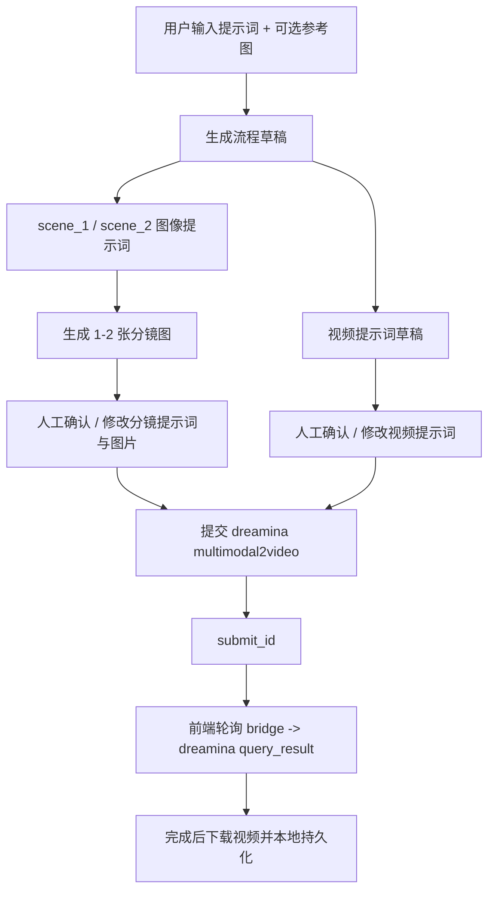
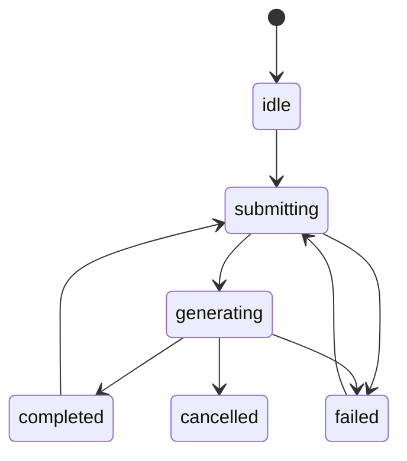

# Seedance 极速视频生成流程设计

## 1. 背景

当前系统已有两条主流程：

- 通用创意视频：
  `input -> brief -> shots -> videos`
- 广告片：
  `adInput -> adStrategy -> adScript -> adStoryboard -> adVideo`

本次新增第三条并行流程：

`fastInput -> fastStoryboard -> fastVideo`

目标是把 `kafka_seaside_video` 中已经验证过的这条链路产品化：

`文本 -> 分镜图提示词 -> 分镜图(1-2张) -> 视频提示词 -> Seedance CLI 提交 -> 任务轮询 -> 视频结果`

参考来源：

- [`WORKFLOW_INTEGRATION.md`](external-reference/WORKFLOW_INTEGRATION.md)
- [`poll_dreamina_result.py`](external-reference/scripts/poll_dreamina_result.py)
- 示例提示词：
  [`scene1_afternoon_image_prompt.txt`](external-reference/prompts/scene1_afternoon_image_prompt.txt)
  [`scene2_midnight_image_prompt_v2.txt`](external-reference/prompts/scene2_midnight_image_prompt_v2.txt)
  [`video_prompt.txt`](external-reference/prompts/video_prompt.txt)

## 2. 需求拆解

### 2.1 用户要求

1. 在“模型 API 配置”中增加 `Seedance 2.0 CLI`
2. 不配置 API Key，直接调用本地 CLI
3. 页面上要能显示：
   - CLI 是否可用
   - 是否已登录成功
4. 首页增加“极速视频生成”入口
5. 新流程的最小输入只有：
   - 提示词
   - 参考图（可选）
6. 后续自动衍生并允许人工确认/修改：
   - 分镜图提示词
   - 分镜图 1-2 张
   - 视频提示词
7. 最终提交 `dreamina multimodal2video`，并显示任务状态
8. UI 和功能尽量复用现有板块

### 2.2 从集成样例抽取出的约束

已在本机于 `2026-04-02` 验证：

- `dreamina -h` 可执行
- `dreamina multimodal2video -h` 可执行
- `dreamina user_credit` 可返回余额 JSON，说明本机 CLI 已安装且当前有登录态

当前 CLI 约束：

- 核心命令：`dreamina multimodal2video`
- `model_version` 仅观察到：
  - `seedance2.0`
  - `seedance2.0fast`
- 至少需要 1 个 `--image` 或 `--video`
- `duration` 支持 `4-15s`
- `video_resolution` 当前仅 `720p`
- 异步任务通过 `submit_id` + `dreamina query_result` 轮询

这意味着“极速视频生成”不能走现有 Gemini / Ark 的浏览器直连视频接口，而必须单独接入本地 CLI。

## 3. 关键架构判断

### 3.1 当前系统不能直接从前端调用本地 CLI

现有仓库本质上是浏览器驱动的单页应用，主状态集中在：

- [`src/App.tsx`](src/App.tsx)

模型调用走：

- [`src/services/modelService.ts`](src/services/modelService.ts)
- [`src/services/geminiService.ts`](src/services/geminiService.ts)
- [`src/services/volcengineService.ts`](src/services/volcengineService.ts)

这些调用都是浏览器直接请求远端 API。浏览器本身无法安全稳定地：

- 检查本地 `dreamina` 是否存在
- 调用本地二进制
- 读取本地登录态
- 把浏览器中的图片 blob 变成 CLI 可读文件路径

所以必须新增一个本地桥接层。

### 3.2 Seedance CLI 不应先塞进现有通用视频流程

现有“创意视频”和“广告片”视频执行都围绕旧的 `Shot` / `AdSegment` 数据形态，以及 Gemini / Ark 的请求方式组织。

如果直接把默认视频模型切成 Seedance CLI，会立刻遇到几个问题：

- 旧流程的视频请求形态不是 `multimodal2video`
- 旧流程依赖首尾帧/参考资产的既有组装逻辑
- 旧流程的状态字段和错误解析都基于现有 API 返回

因此本次设计选择：

- 在“API 配置”中新增 `Seedance 2.0 CLI` 连接卡片
- 但第一期只服务新的“极速视频生成”流程
- 不把它接入全局 `默认视频模型` 的主选择器

这样可以满足需求，同时避免把旧流程拉入一次高风险重构。

## 4. 设计原则

### 4.1 新增独立流程，不污染旧 `Shot`

参考广告流的做法，不把“极速视频生成”的状态塞进旧 `Shot` 或 `AdSegment`。

新增独立领域对象：

- `FastVideoInput`
- `FastSceneDraft`
- `FastVideoPromptDraft`
- `SeedanceTask`
- `FastVideoProject`

顶层仍挂在 `Project` 下，与 `adFlow` 平行，建议新增：

- `project.fastFlow`

### 4.2 尽量复用现有页面模式

复用目标：

- 首页项目入口卡片样式：
  [`src/App.tsx`](src/App.tsx)
- 广告流的 feature slice 目录结构：
  [`src/features/adFlow/`](src/features/adFlow)
- 分镜卡片 UI：
  [`AdStoryboardView.tsx`](src/features/adFlow/components/AdStoryboardView.tsx)
- 视频执行与状态面板：
  [`AdVideoView.tsx`](src/features/adFlow/components/AdVideoView.tsx)
- 媒体本地持久化：
  [`mediaStorage.ts`](src/services/mediaStorage.ts)
- 模型调用日志：
  [`modelInvocationLog.ts`](src/services/modelInvocationLog.ts)

### 4.3 把外部样例中的“图像提示词”和“视频提示词”彻底分开

沿用 [`WORKFLOW_INTEGRATION.md`](external-reference/WORKFLOW_INTEGRATION.md) 的结论：

- 分镜图提示词负责“静态构图”
- 视频提示词负责“运动、时间变化、镜头语言、约束”

不要把两者混成一个字段。

### 4.4 以 `submit_id` 作为 durable state

不在前端存放不可恢复的 CLI 进程状态，持久状态只保存：

- `submit_id`
- 最近一次查询结果
- 任务状态
- 下载后的视频存储键

页面刷新后可继续轮询。

## 5. 信息架构

### 5.1 首页

在首页新增第三张流程卡片：

- 名称：`极速视频生成`
- 描述：`从一句提示词和可选参考图，快速生成 1-2 张分镜图并提交 Seedance CLI`

建议与现有两张卡片并列：

- 创意视频
- 广告片
- 极速视频生成

### 5.2 侧边栏

新增第三组导航：

- `fastInput`：极速输入
- `fastStoryboard`：分镜确认
- `fastVideo`：视频执行

对应现有风格：

- 创意视频流程
- 广告片流程
- 极速视频流程

### 5.3 项目类型

建议新增：

- `ProjectType = 'fast-video'`

原因：

- 首页和项目卡片本来就是按流程类型建模
- 便于恢复进入对应视图
- 便于后续统计、分组和项目摘要展示

## 6. 流程设计



### 6.1 Step 1: 极速输入 `fastInput`

用户只需要填写：

- 主提示词 `prompt`
- 参考图 `referenceImage`（可选，v1 先支持单张）
- 画幅 `aspectRatio`
- 时长 `durationSec`

可选高级项：

- 视频风格补充
- 负面限制词
- 分镜数量偏好：
  - 自动
  - 1 张
  - 2 张

点击“生成流程草稿”后，文本模型一次产出：

- 推荐分镜数 `1-2`
- 每张分镜图提示词
- 连续性锚点
- 视频提示词草稿

### 6.2 Step 2: 分镜确认 `fastStoryboard`

页面展示 1-2 张分镜卡片，每张卡片包含：

- 分镜标题
- 分镜用途摘要
- 图像提示词
- 负面提示词
- 生成图片
- “重新生成此图”
- “锁定此图”

交互规则：

- 第 1 张图可用用户上传参考图作为生成参考
- 若有第 2 张图，默认用第 1 张图作为连续性参考
- 用户可以直接手改提示词后重新生成
- 用户也可以上传本地图替换

这一步主要复用广告分镜页的卡片式布局与图片预览模式。

### 6.3 Step 3: 视频执行 `fastVideo`

页面展示：

- 已确认的 1-2 张分镜图
- 可编辑视频提示词
- Seedance CLI 执行参数
- 提交按钮
- 任务状态卡片
- 完成后的视频预览

执行参数建议：

- `modelVersion`
  - `seedance2.0`
  - `seedance2.0fast`
- `duration`
  - 默认跟输入页同步
- `ratio`
  - 默认跟输入页同步
- `videoResolution`
  - 固定 `720p`

任务状态展示：

- `idle`
- `submitting`
- `generating`
- `completed`
- `failed`
- `cancelled`

以及附加信息：

- `submit_id`
- `gen_status`
- `queue_status`
- 最近轮询时间
- 错误信息

## 7. API 配置页设计

### 7.1 新增 Seedance CLI 连接卡片

在 [`renderApiConfigView`](src/App.tsx) 现有“连接配置”区域增加第三张卡片：

- 标题：`Seedance 2.0 CLI`
- 说明：`极速视频生成专用，本地 dreamina CLI，无需 API Key`

卡片字段：

- CLI 状态：
  - 可用
  - 不可用
- 登录状态：
  - 已登录
  - 未登录
- 余额：
  - `total_credit`
- 默认模型版本：
  - `seedance2.0`
  - `seedance2.0fast`
- 默认轮询间隔：
  - 10s / 15s
- 按钮：
  - `重新检查`

辅助提示：

- 未安装时显示：
  `未检测到 dreamina 命令`
- 未登录时显示：
  `请先在本机终端执行 dreamina login 或 dreamina login --headless`

### 7.2 不新增 API Key 输入框

该卡片明确不出现 API Key 输入项。

### 7.3 不进入全局默认视频模型主选择器

当前默认模型配置仍保持：

- 文本模型
- 生图模型
- 视频模型

但 Seedance CLI 先不挂进这个统一选择器，避免对旧流程造成错误期待。它作为“极速视频生成专用执行器”单独配置。

## 8. 本地桥接层设计

### 8.1 新增 Node/Express bridge

建议新增目录：

```text
server/
  seedanceBridge.ts
  services/
    seedanceCli.ts
    seedanceArtifacts.ts
    seedanceHealth.ts
```

理由：

- 仓库已存在 `express` 与 `tsx` 依赖
- 不必引入新的运行时
- 比让前端直接依赖 Python 脚本更符合当前技术栈

### 8.2 bridge 职责

1. 检查 CLI 可用性
2. 检查登录态与余额
3. 接收前端上传的分镜图并落到临时目录
4. 调用 `dreamina multimodal2video`
5. 用 `submit_id` 查询任务状态
6. 下载输出视频到临时目录
7. 把本地文件通过 HTTP 暴露给前端下载/持久化

### 8.3 bridge 接口建议

#### `GET /api/seedance/health`

返回：

```json
{
  "cliAvailable": true,
  "loginStatus": "logged_in",
  "modelVersions": ["seedance2.0", "seedance2.0fast"],
  "credit": {
    "vip_credit": 14825,
    "gift_credit": 80,
    "purchase_credit": 0,
    "total_credit": 14905
  },
  "checkedAt": "2026-04-02T10:00:00+08:00"
}
```

检查逻辑：

- `dreamina -h` 成功 -> `cliAvailable = true`
- `dreamina user_credit` 返回可解析 JSON -> `loginStatus = logged_in`
- 若报未登录/无会话错误 -> `loginStatus = logged_out`

#### `POST /api/seedance/submit`

请求：

```json
{
  "projectId": "fast-project-1",
  "prompt": "最终视频提示词",
  "images": [
    {
      "filename": "scene-1.png",
      "mimeType": "image/png",
      "dataBase64": "..."
    }
  ],
  "options": {
    "modelVersion": "seedance2.0",
    "ratio": "16:9",
    "duration": 10,
    "videoResolution": "720p"
  }
}
```

返回：

```json
{
  "submitId": "8617f783db62553b",
  "genStatus": "querying",
  "raw": {}
}
```

bridge 内部行为：

- 将图片写入 `os.tmpdir()/renren-ai-video/seedance/<projectId>/<submitAttemptId>/`
- 调用：
  `dreamina multimodal2video --image ... --prompt ... --model_version=... --ratio=... --video_resolution=720p --duration=... --poll=0`
- 解析 stdout JSON

#### `GET /api/seedance/task/:submitId`

调用：

- `dreamina query_result --submit_id=<id> --download_dir <tmp-dir>`

返回：

```json
{
  "submitId": "8617f783db62553b",
  "genStatus": "querying",
  "queueInfo": {
    "queue_status": "Generating",
    "queue_idx": 0,
    "queue_length": 1
  },
  "downloadedFiles": [],
  "raw": {}
}
```

若成功：

```json
{
  "submitId": "8617f783db62553b",
  "genStatus": "success",
  "downloadedFiles": [
    {
      "name": "final.mp4",
      "url": "/api/seedance/file/8617f783db62553b/final.mp4"
    }
  ],
  "raw": {}
}
```

#### `GET /api/seedance/file/:submitId/:filename`

直接返回 bridge 本地已下载的视频文件。

### 8.4 为什么不直接复用 Python 轮询脚本

[`poll_dreamina_result.py`](external-reference/scripts/poll_dreamina_result.py) 很适合作为参考实现，但不建议在本项目里直接作为运行时主依赖。

原因：

- 当前仓库主栈是 TypeScript + React
- 本地桥接层已经需要 Node
- 前端最终还是要通过 HTTP 获取状态

更稳妥的做法是：

- 复用 Python 脚本里的状态机和错误处理思想
- 在 Node bridge 中重写为 TS 版本

## 9. 前端数据模型

建议新增：

```ts
type ProjectType = 'creative-video' | 'ad-video' | 'fast-video';

interface FastVideoInput {
  prompt: string;
  referenceImageUrl?: string;
  aspectRatio: AspectRatio;
  durationSec: number;
  preferredSceneCount: 'auto' | 1 | 2;
  styleHint?: string;
  negativePrompt?: string;
}

interface FastSceneDraft {
  id: string;
  title: string;
  summary: string;
  imagePrompt: string;
  negativePrompt?: string;
  continuityAnchors: string[];
  imageUrl?: string;
  imageStorageKey?: string;
  locked?: boolean;
  status?: 'idle' | 'generating' | 'completed' | 'failed';
  error?: string;
}

interface FastVideoPromptDraft {
  prompt: string;
  promptZh?: string;
}

interface SeedanceTask {
  submitId?: string;
  status: 'idle' | 'submitting' | 'generating' | 'completed' | 'failed' | 'cancelled';
  genStatus?: string;
  queueStatus?: string;
  error?: string;
  raw?: unknown;
  videoUrl?: string;
  videoStorageKey?: string;
  lastCheckedAt?: string;
}

interface FastVideoProject {
  input: FastVideoInput;
  scenes: FastSceneDraft[];
  videoPrompt: FastVideoPromptDraft | null;
  cliConfig: {
    modelVersion: 'seedance2.0' | 'seedance2.0fast';
    pollIntervalSec: number;
    videoResolution: '720p';
  };
  task: SeedanceTask;
}
```

顶层 `Project` 建议扩展：

```ts
interface Project {
  ...
  fastFlow: FastVideoProject;
}
```

## 10. 前端目录设计

建议新增：

```text
src/features/fastVideoFlow/
  components/
    FastInputView.tsx
    FastStoryboardView.tsx
    FastVideoView.tsx
  services/
    fastFlowMappers.ts
    fastPromptBuilders.ts
    seedanceBridgeClient.ts
  types/
    fastTypes.ts
```

边界约束：

- `types/`：只放极速流程领域模型
- `services/`：只放纯函数和 bridge client
- `components/`：只管 UI
- `App.tsx`：只做项目级状态接线

## 11. 复用策略

### 11.1 复用现有项目与导航骨架

复用：

- 首页项目卡片
- 项目分组
- `view` 驱动的页面切换
- 项目自动保存与恢复入口

需要新增：

- `fast-video` 类型卡片
- `getProjectResumeView` 的 fast flow 分支
- `getProjectSummary` 的 fast flow 摘要

### 11.2 复用现有媒体持久化

建议新增方法：

- `createFastSceneImageStorageKey(projectId, sceneId)`
- `createFastVideoStorageKey(projectId)`

沿用 [`mediaStorage.ts`](src/services/mediaStorage.ts) 的 blob 持久化方式。

### 11.3 复用现有轮询模式

当前 [`src/App.tsx`](src/App.tsx) 已有 10 秒轮询视频任务的 `useEffect + setInterval` 模式。

新流程继续沿用这一前端轮询框架，只是把 `checkVideoStatus` 替换为：

- `seedanceBridgeClient.getTask(submitId)`

### 11.4 复用现有日志面板

建议扩展 [`modelInvocationLog.ts`](src/services/modelInvocationLog.ts)：

- `provider` 新增 `seedance-cli`
- 记录以下操作：
  - `seedanceHealthCheck`
  - `seedanceSubmit`
  - `seedanceQueryResult`

这样 API 配置页的日志区不需要另起一套 UI。

## 12. 分镜与提示词生成规则

### 12.1 分镜数量

v1 规则：

- 默认自动生成 1-2 张
- 若用户提示词包含明显时间转换/场景转换，优先 2 张
- 若提示词更像单镜头动作，优先 1 张

### 12.2 连续性策略

当生成第 2 张图时，自动注入类似样例中的连续性语言：

- same room / same architecture / same furniture layout
- preserve composition language
- preserve continuity anchors

这直接复用了样例中第二张图提示词的成功经验。

### 12.3 视频提示词结构

默认由四部分组成：

1. 开场状态
2. 镜头运动
3. 转变/推进
4. 风格与禁止事项

对应样例中的：

- opening visual state
- camera motion
- time shift
- style requirements

## 13. 任务状态机



映射规则：

- `submit` 请求发出但未拿到 `submit_id`：
  `submitting`
- 拿到 `submit_id` 且 `gen_status=querying`：
  `generating`
- `gen_status=success` 且下载到视频：
  `completed`
- `gen_status=fail`：
  `failed`
- 用户主动放弃轮询或 bridge 返回取消态：
  `cancelled`

## 14. UI 草案

### 14.1 首页卡片

- 标题：`极速视频生成`
- 副标题：`一句提示词，最快完成分镜图和 Seedance 视频提交`
- 标签：`Seedance CLI`

### 14.2 分镜页

左右结构：

- 左：流程摘要与全局参数
- 右：1-2 张分镜卡片

每张卡片：

- 图片预览
- 提示词 textarea
- 负面提示词 textarea
- 重新生成按钮
- 锁定按钮

### 14.3 执行页

上方：

- 分镜图条带
- 视频提示词编辑框

下方：

- CLI 参数
- 提交按钮
- 状态卡
- 视频预览

## 15. 开发范围建议

### 一期

1. 新增 `fast-video` 项目类型
2. 首页新增“极速视频生成”
3. API 配置页新增 `Seedance 2.0 CLI` 卡片
4. 新增 Node bridge
5. 新增 `fastInput / fastStoryboard / fastVideo`
6. 接通文本生成分镜提示词和视频提示词
7. 接通分镜生图
8. 接通 Seedance 提交与轮询
9. 接通视频预览和本地持久化

### 二期

1. 支持多参考图
2. 支持音频输入
3. 支持 `multiframe2video` 与 `multimodal2video` 切换
4. 增加任务历史列表
5. 增加重新登录引导按钮

## 16. 风险与处理

### 16.1 本地 CLI 环境差异

风险：

- 用户机器未安装 `dreamina`
- 已安装但未登录
- CLI 输出格式版本差异

处理：

- API 配置页必须先做 health check
- 所有 bridge 解析都保留原始 `raw` 返回
- 失败时展示具体 stderr

### 16.2 浏览器图片到 CLI 文件的转换

风险：

- 浏览器里的 blob URL 不能直接传给 CLI

处理：

- submit 时由 bridge 接收 base64 并落盘

### 16.3 页面刷新后任务丢失

风险：

- 前端只保留内存态会丢失轮询上下文

处理：

- `submit_id` 持久化到项目数据
- 页面恢复后继续轮询 bridge

## 17. 结论

本次设计建议采用：

1. 新增独立 `fast-video` 项目类型，而不是改造旧流程
2. 在 API 配置页新增 `Seedance 2.0 CLI` 状态卡，但先不挂进全局默认视频模型选择器
3. 新增本地 Node/Express bridge，负责本地 CLI 调用与文件落盘
4. 前端新增三步式极速流程：
   `fastInput -> fastStoryboard -> fastVideo`
5. 最大化复用现有首页、导航、分镜卡片、视频状态、媒体持久化与日志面板

如果按这个方案开发，改动面相对可控，而且不会破坏现有创意视频与广告片流程。
