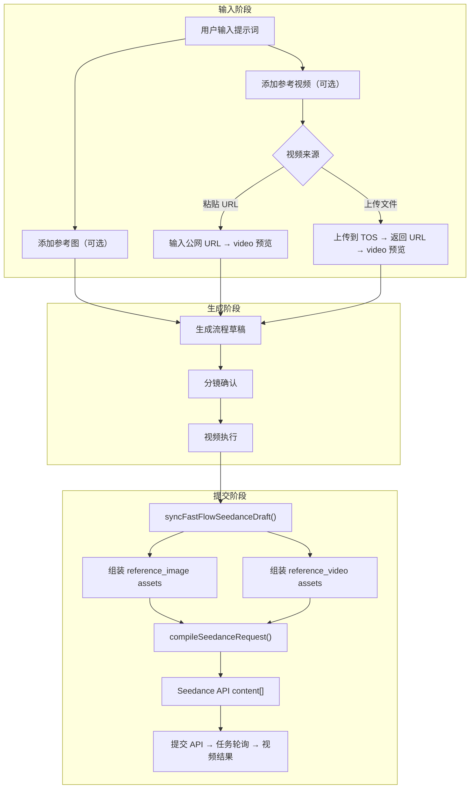

# 视频参考 (Reference Video) 功能设计

## 1. 背景

### 1.1 Seedance 2.0 多模态参考能力

Seedance 2.0 API 支持**多模态参考生视频**：输入参考图片（0-9）+ 参考视频（0-3）+ 参考音频（0-3）+ 文本提示词生成 1 个目标视频。

当前系统已完整支持「参考图片」流程 (`FastReferenceImage`)，本次新增「参考视频」能力，对齐 API 多模态能力。

### 1.2 两级需求

- **基础版**：直接粘贴/输入视频公网 URL，即时在页面预览
- **进阶版**：上传本地视频到火山 TOS，获取公网 URL（需先配置 TOS）

### 1.3 API 约束（来源：[创建视频任务文档](./seedance2.0/创建视频任务.md)）

参考视频要求：

| 约束          | 值                      |
|---------------|-------------------------|
| 格式          | mp4、mov                |
| 分辨率        | 480p、720p              |
| 单视频时长    | [2, 15] s               |
| 最大数量      | 3 个参考视频             |
| 总时长上限    | 所有视频总时长 ≤ 15s     |
| 宽高比        | [0.4, 2.5]              |
| 总像素数      | [409600, 927408]        |
| 单文件大小    | ≤ 50 MB                 |
| FPS           | [24, 60]                |
| role          | `reference_video`       |

API content 结构：

```json
{
  "type": "video_url",
  "video_url": { "url": "https://..." },
  "role": "reference_video"
}
```

## 2. 关键设计决策

### 2.1 在 `multi_image_reference` 模板中混合图片 + 视频

不新增 Fast Flow 专用模板。API 原生支持在同一个请求中混合传入 `reference_image` 和 `reference_video`。

当前 `FAST_FLOW_TEMPLATE_IDS` 保持不变：

```typescript
['free_text', 'first_frame', 'first_last_frame', 'multi_image_reference']
```

`syncFastFlowSeedanceDraft()` 在 `multi_image_reference` 分支中同时组装图片和视频 assets。

### 2.2 视频参考只支持 URL

与图片参考不同，视频参考**不支持** base64 上传（文件过大），必须传公网 URL 或 `asset://` 地址。

交互方式：用户粘贴 URL → 页面 `<video>` 标签即时预览。

### 2.3 TOS 上传采用客户端签名

不依赖后端签名服务。使用火山 TOS JS SDK 在浏览器中直接用 AK/SK 签名上传。

> **安全提示**：AK/SK 存储在 localStorage 中，仅适合内部工具使用。

## 3. 类型层设计

### 3.1 新增 `FastReferenceVideo`

文件：[`src/features/fastVideoFlow/types/fastTypes.ts`](src/features/fastVideoFlow/types/fastTypes.ts)

```typescript
export type FastReferenceVideoType = 'motion' | 'camera' | 'effect' | 'edit' | 'extend' | 'other';

export interface FastReferenceVideo {
  id: string;
  videoUrl: string;                         // 公网 URL（必须）
  referenceType?: FastReferenceVideoType;   // 参考类型
  description?: string;                     // 描述（可选）
  selectedForVideo?: boolean;               // 是否选中参与视频生成
}
```

参考类型映射到功能指导：

| 值       | 含义     | 说明                              |
|----------|----------|-----------------------------------|
| motion   | 动作参考 | 参考视频中的动作节奏              |
| camera   | 运镜参考 | 参考视频的运镜方式                |
| effect   | 特效参考 | 参考视频的特效轨迹                |
| edit     | 视频编辑 | 在现有视频上做元素增删改          |
| extend   | 视频延长 | 对视频做前后延长                  |
| other    | 其他     | 通用参考                          |

### 3.2 扩展 `FastVideoInput`

```typescript
export interface FastVideoInput {
  prompt: string;
  referenceImages: FastReferenceImage[];
  referenceVideos: FastReferenceVideo[];    // ← 新增
  aspectRatio: AspectRatio;
  durationSec: number;
  preferredSceneCount: FastSceneCountPreference;
  quickCutEnabled?: boolean;
  negativePrompt?: string;
}
```

### 3.3 新增 TOS 配置类型

文件：[`src/types.ts`](src/types.ts)

```typescript
export interface TosConfig {
  enabled: boolean;
  region: string;           // 例：cn-beijing
  endpoint: string;         // 例：https://tos-cn-beijing.volces.com
  bucket: string;           // 例：my-video-bucket
  accessKeyId: string;
  accessKeySecret: string;
  pathPrefix?: string;      // 上传路径前缀，例：reference-videos/
}
```

在 `ApiSettings` 中新增：

```typescript
export interface ApiSettings {
  gemini: GeminiApiConfig;
  volcengine: VolcengineApiConfig;
  seedance: SeedanceApiConfig;
  tos?: TosConfig;          // ← 新增
  defaultModels: DefaultModelSettings;
}
```

## 4. UI 层设计

### 4.1 FastInputView — 参考视频区域

文件：[`src/features/fastVideoFlow/components/FastInputView.tsx`](src/features/fastVideoFlow/components/FastInputView.tsx)

在现有参考图 `StudioPanel` 下方新增「参考视频」面板：

```
┌──────────────────────────────────────────────┐
│  参考视频                                      │
│  可选，最多 3 个。粘贴公网 URL 即可预览。        │
│                                              │
│  ┌───────────────────────────────────────┐   │
│  │  参考视频 1                     [×]     │   │
│  │  ┌──────────────────────────────┐     │   │
│  │  │  <video> 预览区              │     │   │
│  │  │  (如果 URL 有效则播放/暂停)    │     │   │
│  │  │  (如果 URL 为空则显示提示)     │     │   │
│  │  └──────────────────────────────┘     │   │
│  │  [URL 输入框] _____________           │   │
│  │  [上传到 TOS] (需先配置TOS)           │   │
│  │  参考类型：[动作参考 ▾]               │   │
│  │  描述（可选）：[________________]     │   │
│  └───────────────────────────────────────┘   │
│                                              │
│  [+ 添加参考视频]                              │
└──────────────────────────────────────────────┘
```

#### 新增 Props

```typescript
type Props = {
  // ... existing props ...
  onAddReferenceVideo: () => void;
  onUpdateReferenceVideo: (referenceId: string, patch: Partial<FastReferenceVideo>) => void;
  onRemoveReferenceVideo: (referenceId: string) => void;
  onUploadVideoToTos?: (file: File, referenceId: string) => void;  // 进阶
  tosConfigured?: boolean;  // TOS 是否已配置
};
```

#### 参考视频类型选项

```typescript
const REFERENCE_VIDEO_TYPE_OPTIONS: Array<{
  value: NonNullable<FastReferenceVideo['referenceType']>;
  label: string;
}> = [
  { value: 'motion', label: '动作参考' },
  { value: 'camera', label: '运镜参考' },
  { value: 'effect', label: '特效参考' },
  { value: 'edit', label: '视频编辑' },
  { value: 'extend', label: '视频延长' },
  { value: 'other', label: '其他参考' },
];
```

#### 视频预览组件

```tsx
function VideoUrlPreview({ url }: { url: string }) {
  const [error, setError] = useState(false);

  if (!url.trim()) {
    return (
      <div className="aspect-video flex flex-col items-center justify-center gap-3 ...">
        <Video className="w-5 h-5" />
        <div>输入视频 URL 后自动预览</div>
      </div>
    );
  }

  if (error) {
    return (
      <div className="aspect-video flex items-center justify-center ...">
        <span>视频加载失败，请检查 URL</span>
      </div>
    );
  }

  return (
    <div className="aspect-video overflow-hidden rounded-xl">
      <video
        src={url}
        controls
        preload="metadata"
        onError={() => setError(true)}
        className="w-full h-full object-contain"
      />
    </div>
  );
}
```

#### URL 输入交互

- 使用 `<input type="url">` 或 `<input type="text">`
- 用户粘贴 URL 后，`onChange` 立刻调用 `onUpdateReferenceVideo(id, { videoUrl })`
- 视频预览区自动加载新 URL
- 支持 `onPaste` 事件直接从剪贴板获取 URL

### 4.2 FastVideoView — 参考视频选中展示

文件：[`src/features/fastVideoFlow/components/FastVideoView.tsx`](src/features/fastVideoFlow/components/FastVideoView.tsx)

在「参考素材与已确认分镜」横向滚动区域中，追加参考视频缩略卡：

```
[参考图1] [参考图2] [分镜1] [分镜2] [视频1] [视频2]
```

每个视频卡片：

- 使用 `<video>` 标签截取首帧作为缩略图（`preload="metadata"`）
- 支持勾选/取消勾选
- 显示类型标签，如「动作参考」
- 用视频图标 `<Video>` 和蓝色边框区分图片卡片

新增 Props：

```typescript
onToggleReferenceVideoSelection: (referenceId: string) => void;
```

### 4.3 API 配置页 — TOS 配置区域

在 API 配置页面（`App.tsx` 中 `renderApiConfigView`）新增 TOS 配置面板：

```
┌──────────────────────────────────────────────────┐
│  火山 TOS 对象存储配置                              │
│  用于上传参考视频到 TOS 并获取公网 URL               │
│                                                  │
│  ☐ 启用 TOS 上传                                  │
│                                                  │
│  Region:      [cn-beijing          ]             │
│  Endpoint:    [https://tos-cn-beijing.volces.com]│
│  Bucket:      [my-bucket           ]             │
│  AccessKey ID:    [AK...           ]             │
│  AccessKey Secret:[SK...           ]             │
│  路径前缀:    [reference-videos/   ]              │
│                                                  │
│  ⚠ AK/SK 仅存储在浏览器本地，仅适合内部工具使用      │
└──────────────────────────────────────────────────┘
```

## 5. Flow Mapper 层设计

### 5.1 创建与规范化

文件：[`src/features/fastVideoFlow/services/fastFlowMappers.ts`](src/features/fastVideoFlow/services/fastFlowMappers.ts)

#### `createEmptyFastVideoInput()` 变更

```typescript
export function createEmptyFastVideoInput(): FastVideoInput {
  return {
    prompt: '',
    referenceImages: [],
    referenceVideos: [],     // ← 新增
    aspectRatio: '16:9',
    durationSec: 10,
    preferredSceneCount: 'auto',
    quickCutEnabled: false,
    negativePrompt: '',
  };
}
```

#### 新增 `normalizeReferenceVideos()`

```typescript
function normalizeFastReferenceVideoType(value: unknown): FastReferenceVideoType {
  return value === 'motion' || value === 'camera' || value === 'effect'
    || value === 'edit' || value === 'extend' || value === 'other'
    ? value
    : 'other';
}

function normalizeReferenceVideos(value: unknown): FastReferenceVideo[] {
  if (!Array.isArray(value)) {
    return [];
  }

  return value
    .filter((item) => item && typeof item === 'object')
    .map((item, index) => {
      const candidate = item as Partial<FastReferenceVideo>;
      return {
        id: typeof candidate.id === 'string' && candidate.id.trim()
          ? candidate.id
          : `fast-reference-video-${index + 1}`,
        videoUrl: typeof candidate.videoUrl === 'string' ? candidate.videoUrl : '',
        referenceType: normalizeFastReferenceVideoType(candidate.referenceType),
        description: typeof candidate.description === 'string' ? candidate.description : '',
        selectedForVideo: isFastAssetSelectedForVideo(candidate.selectedForVideo),
      };
    });
}
```

#### `normalizeFastVideoProject()` 变更

在 `input` 规范化块中加入：

```typescript
referenceVideos: normalizeReferenceVideos(input.referenceVideos),
```

### 5.2 Draft 同步 — `syncFastFlowSeedanceDraft()`

在 `multi_image_reference` 分支中，现有逻辑组装图片 assets 后，追加视频 assets：

```typescript
if (baseDraft.baseTemplateId === 'multi_image_reference') {
  const referenceAssets = [
    // --- 现有图片 assets（不变）---
    ...selectedReferenceImages.map((reference, index) => ({ ... })),
    ...selectedReadyScenes.map((scene, index) => ({ ... })),

    // --- 新增视频 assets ---
    ...selectedReferenceVideos.map((video, index) => ({
      id: video.id || `fast-reference-video-${index + 1}`,
      kind: 'video' as const,
      source: 'url' as const,
      urlOrData: video.videoUrl,
      role: 'reference_video' as const,
      label: `参考视频${index + 1}是${getReferenceVideoTypeLabel(video.referenceType)}${
        video.description?.trim() ? `，${video.description.trim()}` : ''
      }`,
    })),
  ];

  // ... 去重和过滤逻辑保持不变 ...
}
```

其中 `selectedReferenceVideos` 的计算：

```typescript
const originalReferenceVideos = fastFlow.input.referenceVideos.filter(
  (item) => item.videoUrl.trim()
);
const selectedReferenceVideos = originalReferenceVideos.filter(
  (item) => isFastAssetSelectedForVideo(item.selectedForVideo)
);
```

### 5.3 模板推断

当有参考图或参考视频时，自动选择 `multi_image_reference` 模板：

```typescript
export function createDefaultFastSeedanceDraft(
  input: FastVideoInput,
  videoPrompt?: string,
): SeedanceDraft {
  const hasReferenceMedia =
    input.referenceImages.some((item) => item.imageUrl.trim()) ||
    input.referenceVideos.some((item) => item.videoUrl.trim());    // ← 新增判断

  return {
    baseTemplateId: hasReferenceMedia ? 'multi_image_reference' : 'first_last_frame',
    // ... rest unchanged ...
  };
}
```

## 6. 提示词构建层设计

### 6.1 参考视频上下文

文件：[`src/features/fastVideoFlow/services/fastPromptBuilders.ts`](src/features/fastVideoFlow/services/fastPromptBuilders.ts)

#### 新增常量

```typescript
const FAST_REFERENCE_VIDEO_TYPE_LABELS: Record<
  NonNullable<FastReferenceVideo['referenceType']>,
  string
> = {
  motion: '动作参考视频',
  camera: '运镜参考视频',
  effect: '特效参考视频',
  edit: '视频编辑参考',
  extend: '视频延长参考',
  other: '其他参考视频',
};
```

#### 新增 `buildFastReferenceVideoDetails()`

```typescript
function buildFastReferenceVideoDetails(input: FastVideoInput) {
  const readyVideos = input.referenceVideos.filter((item) => item.videoUrl.trim());

  if (readyVideos.length === 0) {
    return 'No reference videos are available.';
  }

  return readyVideos.map((video, index) => (
    `- 参考视频${index + 1}: type=${
      FAST_REFERENCE_VIDEO_TYPE_LABELS[video.referenceType || 'other']
    }; description=${(video.description || '').trim() || 'N/A'}`
  )).join('\n');
}
```

#### 更新 `buildFastVideoPlanPrompt()`

在用户输入块中追加：

```
- Reference video count: ${referenceVideoCount}

Reference video details:
${buildFastReferenceVideoDetails(input)}
```

在指令中追加：

```
If reference videos are present, you must explicitly describe how each reference video's
motion/camera/effect should be applied or referenced in the final video prompt.
```

#### 更新 `buildFastVideoPromptRegenerationPrompt()`

类似地追加参考视频的上下文信息。

## 7. 状态管理层设计

### 7.1 App.tsx 新增 Handlers

文件：[`src/App.tsx`](src/App.tsx)

#### `handleAddFastReferenceVideo()`

```typescript
const handleAddFastReferenceVideo = () => {
  const currentCount = project.fastFlow.input.referenceVideos.length;
  if (currentCount >= 3) {
    return;  // API 限制最多 3 个
  }

  setFastFlow((current) => ({
    ...current,
    input: {
      ...current.input,
      referenceVideos: [
        ...current.input.referenceVideos,
        {
          id: crypto.randomUUID?.() || `fast-reference-video-${Date.now()}`,
          videoUrl: '',
          referenceType: 'other',
          description: '',
          selectedForVideo: true,
        },
      ],
    },
  }));
};
```

#### `handleUpdateFastReferenceVideo()`

```typescript
const handleUpdateFastReferenceVideo = (
  referenceId: string,
  patch: Partial<FastReferenceVideo>,
) => {
  setFastFlow((current) => ({
    ...current,
    input: {
      ...current.input,
      referenceVideos: current.input.referenceVideos.map((item) =>
        item.id === referenceId ? { ...item, ...patch } : item
      ),
    },
  }));
};
```

#### `handleRemoveFastReferenceVideo()`

```typescript
const handleRemoveFastReferenceVideo = (referenceId: string) => {
  setFastFlow((current) => ({
    ...current,
    input: {
      ...current.input,
      referenceVideos: current.input.referenceVideos.filter(
        (item) => item.id !== referenceId
      ),
    },
  }));
};
```

#### `handleToggleFastReferenceVideoSelection()`

```typescript
const handleToggleFastReferenceVideoSelection = (referenceId: string) => {
  setFastFlow((current) => ({
    ...current,
    input: {
      ...current.input,
      referenceVideos: current.input.referenceVideos.map((item) =>
        item.id === referenceId
          ? { ...item, selectedForVideo: item.selectedForVideo === false }
          : item
      ),
    },
  }));
};
```

### 7.2 renderFastInputView 更新

```tsx
const renderFastInputView = () => (
  <FastInputView
    // ... existing props ...
    onAddReferenceVideo={handleAddFastReferenceVideo}
    onUpdateReferenceVideo={handleUpdateFastReferenceVideo}
    onRemoveReferenceVideo={handleRemoveFastReferenceVideo}
    onUploadVideoToTos={tosConfig?.enabled ? handleUploadVideoToTos : undefined}
    tosConfigured={Boolean(tosConfig?.enabled)}
  />
);
```

### 7.3 renderFastVideoView 更新

传递 `onToggleReferenceVideoSelection` prop。

## 8. TOS 上传服务设计

### 8.1 服务文件

新增文件：[`src/services/tosUploadService.ts`](src/services/tosUploadService.ts)

### 8.2 签名方式

使用 **火山 TOS Browser JS SDK** 进行客户端签名直传。

依赖：`@volcengine/tos-sdk`

```bash
npm install @volcengine/tos-sdk
```

### 8.3 核心实现

```typescript
import TOS from '@volcengine/tos-sdk';
import type { TosConfig } from '../types.ts';

function createTosClient(config: TosConfig) {
  return new TOS({
    accessKeyId: config.accessKeyId,
    accessKeySecret: config.accessKeySecret,
    region: config.region,
    endpoint: config.endpoint,
    bucket: config.bucket,
  });
}

function generateObjectKey(config: TosConfig, filename: string) {
  const prefix = (config.pathPrefix || 'reference-videos/').replace(/\/*$/u, '/');
  const timestamp = Date.now();
  const safeFilename = filename.replace(/[^a-zA-Z0-9._-]/gu, '_');
  return `${prefix}${timestamp}-${safeFilename}`;
}

export async function uploadVideoToTos(
  file: File,
  config: TosConfig,
  onProgress?: (percent: number) => void,
): Promise<string> {
  if (!config.enabled) {
    throw new Error('TOS 上传未启用，请先在 API 配置中配置 TOS。');
  }

  if (!config.bucket || !config.accessKeyId || !config.accessKeySecret) {
    throw new Error('TOS 配置不完整，请在 API 配置中填写 Bucket、AccessKey ID 和 AccessKey Secret。');
  }

  // 校验文件
  const maxSizeBytes = 50 * 1024 * 1024; // 50 MB
  if (file.size > maxSizeBytes) {
    throw new Error(`视频文件大小超过 50 MB 限制（当前 ${(file.size / 1024 / 1024).toFixed(1)} MB）。`);
  }

  const allowedTypes = ['video/mp4', 'video/quicktime'];
  if (!allowedTypes.includes(file.type)) {
    throw new Error(`不支持的视频格式 ${file.type}，仅支持 mp4 和 mov。`);
  }

  const client = createTosClient(config);
  const objectKey = generateObjectKey(config, file.name);

  await client.putObject({
    key: objectKey,
    body: file,
    headers: {
      'Content-Type': file.type,
    },
    dataTransferStatusChange: (event) => {
      if (event.type === 1 && onProgress) {
        const percent = Math.round((event.consumedBytes / event.totalBytes) * 100);
        onProgress(percent);
      }
    },
  });

  // 拼接公网 URL
  const endpoint = config.endpoint.replace(/^https?:\/\//u, '');
  return `https://${config.bucket}.${endpoint}/${objectKey}`;
}

export function isTosConfigComplete(config?: TosConfig | null): boolean {
  if (!config || !config.enabled) {
    return false;
  }

  return Boolean(
    config.bucket?.trim() &&
    config.region?.trim() &&
    config.endpoint?.trim() &&
    config.accessKeyId?.trim() &&
    config.accessKeySecret?.trim()
  );
}
```

### 8.4 TOS 上传 Handler (App.tsx)

```typescript
const handleUploadVideoToTos = async (file: File, referenceId: string) => {
  const tosConfig = apiSettings.tos;
  if (!tosConfig?.enabled) {
    return;
  }

  try {
    // 可选：设置上传进度到视频卡片 UI
    const publicUrl = await uploadVideoToTos(file, tosConfig, (percent) => {
      // TODO: 更新上传进度到 UI
      console.log(`上传进度: ${percent}%`);
    });

    handleUpdateFastReferenceVideo(referenceId, { videoUrl: publicUrl });
  } catch (error) {
    console.error('Failed to upload video to TOS:', error);
    openSeedanceErrorModal({
      eyebrow: 'TOS Upload',
      title: '视频上传失败',
      message: '视频上传到 TOS 失败，请检查 TOS 配置或文件格式。',
      detail: error instanceof Error ? error.message : String(error),
    });
  }
};
```

## 9. API 配置层设计

### 9.1 apiConfig.ts 变更

文件：[`src/services/apiConfig.ts`](src/services/apiConfig.ts)

在 `defaultApiSettings` 中新增：

```typescript
export const defaultApiSettings: ApiSettings = {
  // ... existing ...
  tos: {
    enabled: false,
    region: 'cn-beijing',
    endpoint: 'https://tos-cn-beijing.volces.com',
    bucket: '',
    accessKeyId: '',
    accessKeySecret: '',
    pathPrefix: 'reference-videos/',
  },
};
```

在 `normalizeApiSettings()` 中新增 TOS 规范化：

```typescript
tos: {
  enabled: Boolean(settings.tos?.enabled),
  region: typeof settings.tos?.region === 'string' ? settings.tos.region : defaultApiSettings.tos!.region,
  endpoint: typeof settings.tos?.endpoint === 'string' ? settings.tos.endpoint : defaultApiSettings.tos!.endpoint,
  bucket: typeof settings.tos?.bucket === 'string' ? settings.tos.bucket : '',
  accessKeyId: typeof settings.tos?.accessKeyId === 'string' ? settings.tos.accessKeyId : '',
  accessKeySecret: typeof settings.tos?.accessKeySecret === 'string' ? settings.tos.accessKeySecret : '',
  pathPrefix: typeof settings.tos?.pathPrefix === 'string' ? settings.tos.pathPrefix : defaultApiSettings.tos!.pathPrefix,
},
```

在 `loadApiSettings()` 和 `saveApiSettings()` 中相应处理 `tos` 字段。

## 10. Seedance Draft 编译层

### 10.1 seedanceDraft.ts — 无需改动

现有的 `compileSeedanceRequest()` 和 `toCompiledAsset()` 已经支持 `kind === 'video'`：

```typescript
// seedanceDraft.ts line 63-66
if (asset.kind === 'video') {
  return {
    type: 'video_url',
    video_url: { url: asset.urlOrData },
    role: asset.role,
  };
}
```

因此只要 `syncFastFlowSeedanceDraft()` 正确地将参考视频映射为 `SeedanceInputAsset`（`kind: 'video'`, `role: 'reference_video'`），编译层自动工作。

### 10.2 seedanceApiService.ts — normalizeDraftForApi

现有逻辑已经处理了 `kind === 'video'` 的 blob URL 检查和远程 URL 透传：

```typescript
// seedanceApiService.ts line 110-119
if (urlOrData.startsWith('blob:')) {
  throw new Error('当前 Ark Seedance API 不支持直接提交浏览器本地 blob 视频，请改用公网 URL。');
}
if (!isRemoteHttpUrl(urlOrData)) {
  throw new Error('当前 Ark Seedance API 不支持直接提交本地视频地址，请改用公网 URL。');
}
```

远程 URL 的视频素材直接透传，不做任何处理。✅

## 11. Seedance Template Registry — 无需改动

`multi_image_reference` 模板定义中已经没有约束 asset kind 必须是 image。它只检查 `role`:

```typescript
multi_image_reference: {
  requires: [
    { role: 'text', minCount: 1 },
    { role: 'reference_image', minCount: 1, maxCount: 9 },
  ],
}
```

但参考视频的 role 是 `reference_video`，不在 `requires` 列表中。这意味着：

- 验证不会因为多了 `reference_video` 素材而报错
- 但如果**只有**参考视频、没有参考图片，`reference_image` 的 minCount=1 约束会失败

**方案**：当只有参考视频没有参考图片时，将模板选择推到 `motion_reference` 或保持 `multi_image_reference` 但把 `reference_image` 的 minCount 含义扩展。

推荐做法：更新 `multi_image_reference` 的 requires 为条件验证，**或**在 `validateSeedanceDraft()` 中针对混合场景做特殊处理——如果有 `reference_video` 则放松 `reference_image.minCount` 约束。

```typescript
// validateSeedanceDraft() 中添加特殊判断
if (requirement.role === 'reference_image' && matches.length < requirement.minCount) {
  const hasReferenceVideo = draft.assets.some(
    (asset) => asset.role === 'reference_video' && asset.urlOrData.trim()
  );
  if (!hasReferenceVideo) {
    errors.push(`${template.title}缺少 ${requirement.role} 素材。`);
  }
}
```

## 12. 视频参考计费影响

根据 Seedance 定价：

| 场景             | 标准模型 (CNY/百万tokens) | 快速模型 (CNY/百万tokens) |
|------------------|---------------------------|---------------------------|
| 不含视频输入     | 46                        | 37                        |
| 包含视频输入     | 28                        | 22                        |

`FastVideoView` 中的 `getSeedanceCostEstimate()` 已有判断：

```typescript
const includesVideoInput = seedanceDraft.assets.some(
  (asset) => asset.kind === 'video' && asset.urlOrData.trim()
);
```

当参考视频被选中并同步到 `seedanceDraft.assets` 后，计费自动按"包含视频输入"计算。✅

## 13. 完整文件变更清单

| 文件                                  | 变更类型 | 说明                              |
|---------------------------------------|----------|-----------------------------------|
| `types/fastTypes.ts`                  | MODIFY   | 新增 `FastReferenceVideo`；修改 `FastVideoInput` |
| `src/types.ts`                        | MODIFY   | 新增 `TosConfig`；修改 `ApiSettings` |
| `components/FastInputView.tsx`        | MODIFY   | 新增参考视频区域 UI                |
| `components/FastVideoView.tsx`        | MODIFY   | 参考视频选中展示                   |
| `services/fastFlowMappers.ts`         | MODIFY   | 规范化、empty input、draft sync   |
| `services/fastPromptBuilders.ts`      | MODIFY   | 参考视频上下文注入                 |
| `services/seedanceDraft.ts`           | MODIFY   | 混合验证放松                       |
| `services/apiConfig.ts`              | MODIFY   | TOS 配置默认值与规范化             |
| `services/tosUploadService.ts`       | NEW      | TOS 客户端签名上传                 |
| `src/App.tsx`                         | MODIFY   | 新增 handler、props 传递           |

## 14. 流程图



## 15. 开发顺序建议

### Phase 1：基础版（URL 直接预览）

1. 类型定义（`FastReferenceVideo`, `FastVideoInput.referenceVideos`）
2. `fastFlowMappers.ts` 规范化与 empty input
3. `FastInputView.tsx` 参考视频 UI（URL 输入 + video 预览）
4. `App.tsx` 状态管理 handler
5. `fastPromptBuilders.ts` 上下文注入
6. `fastFlowMappers.ts` `syncFastFlowSeedanceDraft()` 视频 asset 组装
7. `seedanceDraft.ts` 混合验证放松
8. `FastVideoView.tsx` 参考视频展示与选中

### Phase 2：进阶版（TOS 上传）

1. `TosConfig` 类型定义
2. `apiConfig.ts` TOS 配置
3. API 配置页 TOS 表单 UI
4. `tosUploadService.ts` 实现
5. `FastInputView.tsx` 上传按钮与进度
6. `App.tsx` 上传 handler

## 16. 验证方案

### 自动验证

```bash
npx tsc --noEmit     # 类型检查
npm run build        # 构建验证
```

### 手动验证清单

1. 输入页面添加参考视频卡片，输入 URL 后视频可正常预览
2. 输入无效 URL 显示加载失败提示
3. 最多添加 3 个参考视频，达到上限后按钮禁用
4. 视频参考类型可选择（动作/运镜/特效等）
5. 视频参考描述可编辑
6. 参考视频 + 参考图片混合后进入视频执行页面
7. 执行页面正确展示参考视频缩略图，可勾选/取消
8. 视频提示词中包含参考视频的上下文信息
9. 提交 API 后确认 `content[]` 包含 `video_url` 类型素材
10. 计费估算自动按"包含视频输入"单价计算
11. （进阶）配置 TOS 后，上传本地视频成功获取公网 URL
12. （进阶）上传进度展示正常
